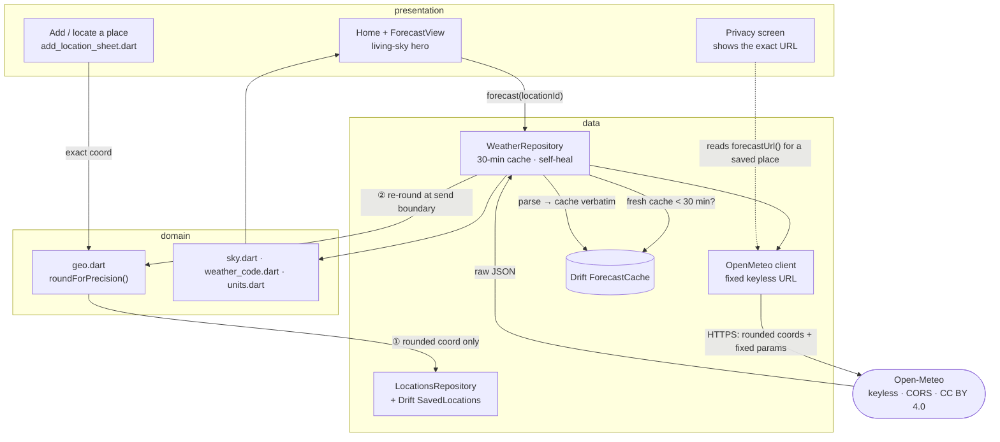

# Architecture overview

How WeatherGlass fits together, and where to look. For *what must stay true*, read
[VISION.md](../../VISION.md) first; for *why* each choice was made, the
[ADRs](../adr/); for the privacy rule stated precisely,
[reference/privacy-invariant.md](../reference/privacy-invariant.md).

## Shape

WeatherGlass is a Flutter app in **feature-first Clean Architecture**. Each feature
owns three layers — `domain` (pure logic, no Flutter, unit-tested), `data`
(repositories, the API client, storage), and `presentation` (screens + widgets) —
and shared plumbing lives under `lib/core` and `lib/shared`. State is wired with
**Riverpod** (code-generated providers); local storage is **Drift** over SQLite
(native on mobile, WASM on web).

```
lib/
├── core/            router (go_router) · Drift database · Riverpod providers · failures
├── shared/          theme · widgets · extensions
└── features/
    ├── weather/
    │   ├── domain/       geo (rounding) · weather_code (WMO) · sky (palette) · units
    │   ├── data/         open_meteo_client · models · weather_repository · locations_repository · geolocation_service
    │   └── presentation/ home · forecast_view · locations · add_location_sheet
    └── settings/
        ├── domain/       settings (units · precision · theme)
        └── presentation/ settings_screen · privacy_screen ("What leaves your device")
```

## The spine — a location's path to the network

The whole design turns on one path: how a place you add reaches the provider. It is
rounded **twice** — once when it is saved, once again at the moment of sending — so
the privacy setting is authoritative no matter when a place was added.



**Read the two rounding points as the safety story:**

1. **Add boundary** (`add_location_sheet.dart` → `roundForPrecision`): the exact
   geocoded or device coordinate is coarsened *before* `LocationsRepository` ever
   sees it. The database only ever holds a rounded value ([`app_database.dart`](../../lib/core/storage/app_database.dart)
   comments this on the `SavedLocations` table).
2. **Send boundary** (`weather_repository.dart` → `roundForPrecision`): every outbound
   request re-rounds the stored coordinate to the *current* precision. Without this, a
   user who later chooses a *coarser* setting would keep leaking the finer grid saved
   earlier. The `forecast` provider watches the precision setting so a change actually
   recomputes and refetches.

The request itself is assembled by `OpenMeteo.forecastUrl` as a **fixed parameter set
plus the rounded coordinates and nothing else** — the property the privacy claim
rests on, pinned by a test. See [privacy-invariant.md](../reference/privacy-invariant.md).

## Module map — where to look

| You're touching… | File(s) |
|---|---|
| **Rounding / precision** (the privacy lever) | `features/weather/domain/geo.dart` |
| **The outbound request** (must stay keyless) | `features/weather/data/open_meteo_client.dart` |
| **Fetch + cache** (30-min TTL, self-heal) | `features/weather/data/weather_repository.dart` |
| **Local storage** (places, cache) | `core/storage/app_database.dart`, `features/weather/data/locations_repository.dart` |
| **Forecast model / JSON parse** | `features/weather/data/models.dart` |
| **Device location** (low-accuracy) | `features/weather/data/geolocation_service.dart` |
| **WMO code → condition + icon** | `features/weather/domain/weather_code.dart` |
| **Living-sky palette** | `features/weather/domain/sky.dart` |
| **Unit conversion / formatting** | `features/weather/domain/units.dart` |
| **Screens** | `features/weather/presentation/*`, `features/settings/presentation/*` |
| **Transparency screen** | `features/settings/presentation/privacy_screen.dart` |
| **Settings state** | `features/settings/settings_controller.dart`, `features/settings/domain/settings.dart` |
| **Navigation** (4 routes: `/`, `/places`, `/privacy`, `/settings`) | `core/router/app_router.dart` |
| **Provider wiring** | `core/providers/core_providers.dart` |

## Storage

Two Drift tables ([`app_database.dart`](../../lib/core/storage/app_database.dart),
schema v1):

- **`SavedLocations`** — the places you watch. Coordinates are stored **already
  rounded**; even a device dump leaks only a coarse cell. Carries a single
  `isCurrent` "My location" entry, re-resolved on demand.
- **`ForecastCache`** — the raw Open-Meteo JSON per location, with a `fetchedAt`
  timestamp. Served without a network call while under the 30-minute TTL; a row that
  fails to parse (e.g. poisoned by an older build) is evicted and refetched rather
  than throwing forever.

## Providers (Riverpod)

`appDatabase` and `openMeteo` are `keepAlive` singletons — they own a closeable
resource (the DB handle, the HTTP client), and were previously torn down mid-request
as `autoDispose` providers, which aborted in-flight searches. The `forecast(locationId)`
provider watches both the saved-locations stream and the precision setting, so a
relocated place or a changed precision recomputes the right forecast.

See [reference/data-model.md](../reference/data-model.md) for exact types and the
response shape.
